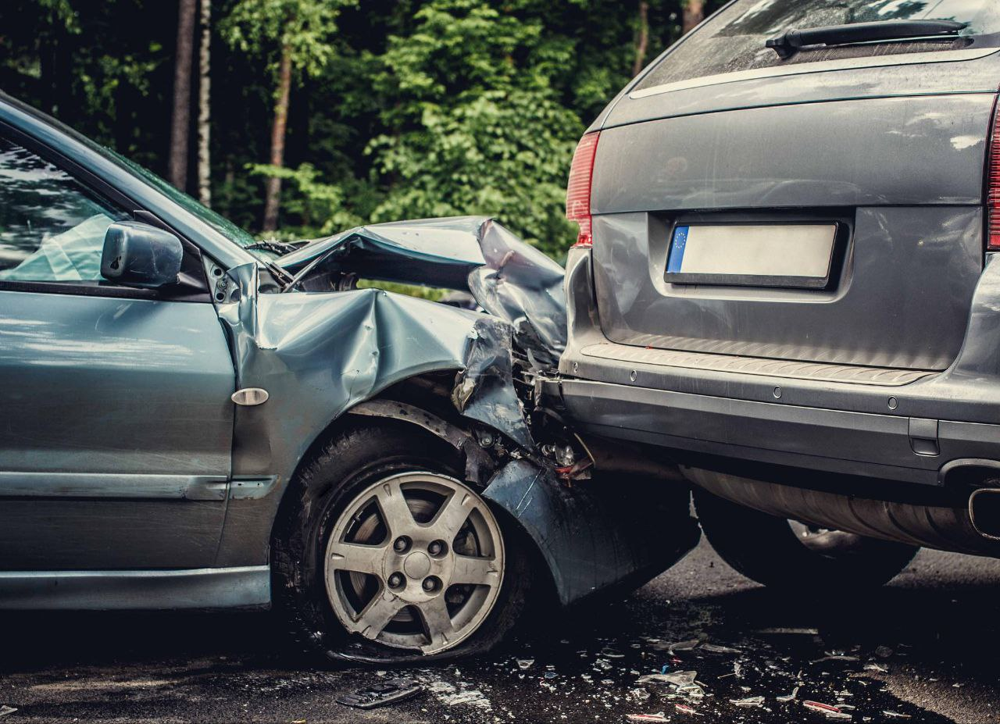
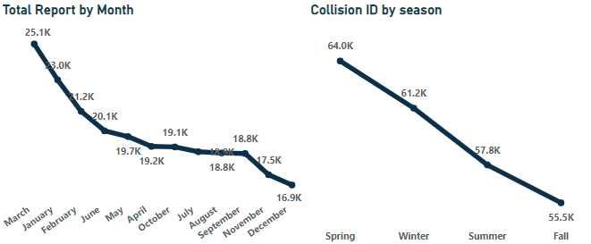
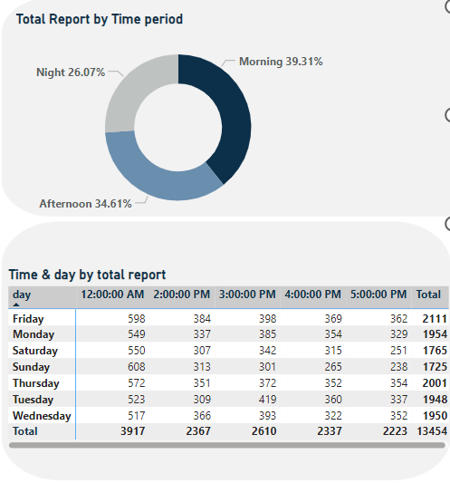
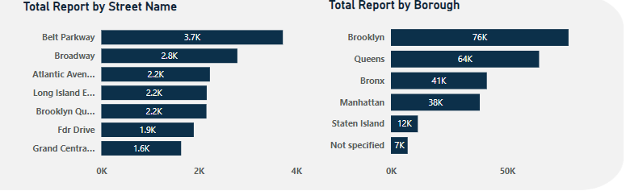
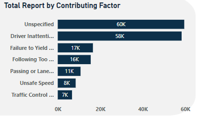
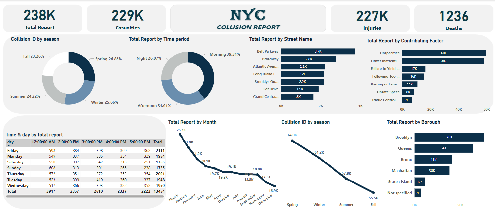

# NYC Collision Report

## Data Source
Capstone project at **Digitaley Drive**

## Introduction
This Power BI project focuses on analyzing traffic collisions in **New York City**, providing a comprehensive overview of their causes, affected areas, key patterns and trends. The report aims to uncover valuable insights to better understand the dynamics of traffic incidents and support data-driven decision-making.

## Problem Statement
1. Compare total accident by month. Do you notice any seasonal patterns?
2. Break down accident by day of the week and hour of the day. base on this data, when do accident occur most frequently?
3. On which particular street were the most accident reported?
4. What was the most contributing factor the accidents reported?

## Concept Execution
The following Power Bi features were incoperated;

- Data sources,
- Data cleaning,
- Power Query,
- Data modeling,
- Caculated Columns and Measures using Dax,
- Data Visualization,
- Filters,
- Dashboard Building and
- Reporting.

## Data Cleaning
In this analysis, null values in the Borough and Street Name columns were replaced with "Not Specified" while Cross Street null values constituting 55% of the data, were updated to "Unknown", null values in the Contributing Factor column were replaced with "Unspecified". the Longitude and Latitude null values were set to 0 using the Find and Replace feature and Additionally, new columns were created for Year, Month, Day, and Hour to enhance analysis.
For consistency, all replaced values match the consistency of missing values for each columns.

## Data Discovery
**1. Compare total accident by month. Do you notice any seasonal patterns?**

*Monthly report* :
Comparing the total accident by month, March recorded the highest number of collisions at (25.1K), a gradual decline is observed from January through December, with December having the fewest incidents (16.9K).

*Seasonal Trend* :
The spring seasonal trend having the most reported collisions may correlate with weather conditions, Spring often brings unpredictable weather, including rainstorms, fog, and sometimes hail, which can create hazardous driving conditions.

**2. Break down accident by day of the week and hour of the day. base on this data, when do accident occur most frequently?**

*Day and Time Breakdown* :
Friday has the highest collision reports (2,111), while Sunday reports fewer incidents (1,725).
Most collisions occur between 3:00 PM and 5:00 PM, correlating with peak traffic hours.

*Time Period* :
Afternoon (39.31%) sees the most collisions, followed by night (34.61%), Morning (26.07%) has the least incidents, possibly due to lighter traffic.

**3. On which particular street were the most accident reported?**

*Streets with Most Collisions* :
- Belt Parkway (3.7K reports) has the highest collision count, Other high-risk streets include:
- Broadway (2.8K),
- Atlantic Avenue, Long Island Expressway, and Brooklyn Queens Expressway (2.2K each).
These streets likely experience heavy traffic or risky driving behaviors.

**4. What was the most contributing factor the accidents reported?**

*Contributing Factors* :
- Unspecified reasons (60K),
- Driver Inattention (58K) as leading causes.
- Failure to Yield (17K),
- Following Too Closely (16K),
- Unsafe Speed (8K).

High "unspecified" numbers indicate a need for better reporting systems, however drivers inattentive including Texting or using phone while driving or generally taking your eyes off the road.

## Visualization

This dashboard provides a comprehensive analysis of traffic collisions, their causes, affected areas and trends.

*Key Features* :

- Total Reports: 238K collisions recorded,
- Casualties: 229K, including injuries and fatalities,
- Injuries: 227K people injured,
- Deaths: 1,236 fatalities reported.

## Recommendations

1. *Driver Awareness Campaigns* :

Target busy streets like Belt Parkway and Broadway to address risky driving.
Educate drivers on the dangers of inattention and failure to yield.

2. *Infrastructure Improvements* :

Consider redesigns or additional safety measures for high-collision streets.
Implement traffic-calming strategies (e.g., speed bumps, better lighting).

3. *Time-Specific Measures* :

Increase enforcement during peak hours (afternoons and evenings).
Deploy additional traffic management resources on Fridays.

4. *Data Improvement* :

Reduce "unspecified" factors by improving accident reporting and investigation processes.
